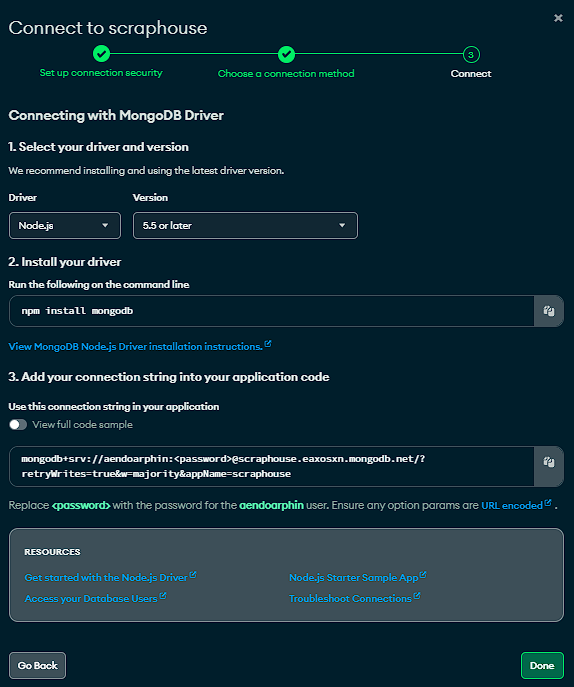

# ScrapHouse: A Combat Sports Media Platform
The key objective for this web app is to centralize compat sports content while maintaining aesthetics and simple navigation.
More exciting features will be considered in the future. Please feel free to contribute!

# Configuring Your Environment
#### Auth0:
1. Register for an account at https://auth0.com/signup
2. Create a new application of type "Regular Web Applications"
3. Choose Next.js integration
4. Follow the quickstart instructions for integrating with Auth0

#### MongoDB:
1. Create a MongoDB Atlas account at https://www.mongodb.com
2. Create a project named "scraphouse"
3. Create a cluster named "scraphouse"
4. Create a database named "scraphouse"
5. Copy URI connection string by navigating to Databases > Connect > Drivers
   

6. Copy and paste the connection string into the relevant field in the provided .env file

    *Calling the routes located in app/api/ufc should automatically add the collections to the DB. If not the case, add three collections to the "scraphouse" DB:*

    - *ufcfighters*
    - *ufcrankings*
    - *ufcschedules*

#### SportRadar: https://console.sportradar.com/
1. Add a trial
2. Choose MMA API
3. Copy API key and add to .env.local

    *When 30 day trial expires, the data stored in the database will be used instead. If updated data is needed, reregister with different email and replace the existing API key.*

#### NewsAPI: https://newsapi.org/
1. Register and follow instruction to get key

# To Do List
1. Rankings
   - UFC ✅
   - PFL
   - ONE FC

2. News
    - Listings ✅
    - Articles ✅
    - Sharing

3. Fighters
    - Profiles
    - Stats

4. Schedule
    - Alerts
    - Event listings ✅